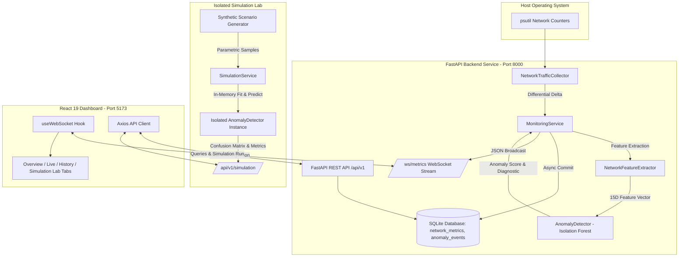

# Smart Network Monitoring AI

> **College Computer Networks & Applied AI Capstone Project**  
> An end-to-end, host-level network observability and unsupervised anomaly detection platform featuring real psutil telemetry collection, FastAPI backend, SQLite time-series persistence, live WebSocket streaming, an isolated synthetic Simulation Lab, and a modern React 19 dark operations dashboard.
>
> 📚 **Complete Documentation Suite**: A complete 12-document beginner-to-advanced technical guide, system architecture, user manual, and viva defense guide is available in [docs/README.md](docs/README.md).

---

## 1. Project Title & Overview

**Smart Network Monitoring AI** is a lightweight, production-structured network telemetry and AI-driven monitoring system. It continuously samples operating system socket counters, derives directional throughput (download/upload Mbps) and packet rates, streams time-series data via WebSockets to a React dashboard, extracts multi-dimensional temporal and volumetric features, and detects out-of-distribution traffic patterns using an unsupervised **Isolation Forest** model.

To overcome the academic challenge of safely testing anomaly detection without causing disruptive network packet floods or physical denial-of-service attacks, the system incorporates an **isolated synthetic Simulation Lab**. The lab runs deterministic, labeled synthetic network scenarios (e.g., sudden download spikes, exfiltration ratio inversions, and SYN flood rate anomalies) entirely in memory against an isolated model instance, reporting statistical confusion matrices and validation metrics.

---

## 2. Problem Statement

Traditional network monitoring solutions often suffer from critical practical shortcomings:
1. **Administrative & Protocol Overhead**: Deep Packet Inspection (DPI) requires promiscuous network interface modes, root/administrator privileges, and raises severe data privacy concerns.
2. **Static Threshold Inflexibility**: Rule-based alert systems rely on fixed throughput thresholds that fail to adapt to varying network adapters (e.g., gigabit Ethernet vs. constrained Wi-Fi).
3. **Safety & Validation Dilemma**: Evaluating network anomaly detectors traditionally requires injecting live packet floods or stress attacks, which can destabilize physical host adapters, violate campus acceptable use policies, and disrupt internet connectivity.

**Smart Network Monitoring AI** solves these challenges by:
* Ingesting standard OS socket I/O counters non-intrusively without root privileges or packet payload capture.
* Employing multi-feature statistical baselines and unsupervised tree isolation to detect multi-metric structural anomalies.
* Providing a strictly isolated, in-memory synthetic simulation harness that produces verifiable, reproducible model benchmarks ($TP, FP, FN, TN, \text{Accuracy}, \text{Precision}, \text{Recall}, \text{F1}, \text{Latency}$) across multiple seeds with zero live packets transmitted.

---

## 3. Actual Implemented Features

### Telemetry Collection & Persistence
* **Non-Intrusive OS Ingestion**: Uses `psutil.net_io_counters(pernic=True)` to track byte and packet deltas.
* **Safe Differential Math**: Handles first-tick baseline calibration, zero elapsed-time guards, and 64-bit integer counter rollover protection.
* **SQLite Persistence**: Stores chronological records in `network_metrics` and detected anomalies in `anomaly_events` with WAL mode enabled.
* **Adapter Autodetection**: Intelligently discovers physical/virtual interfaces and auto-selects the primary active link based on cumulative traffic.

### Real-Time Streaming & REST API
* **Full Asynchronous FastAPI Engine**: Asynchronous lifespan manager, dependency injection, and Pydantic v2 schemas.
* **Live WebSockets (`/ws/metrics`)**: Streams 1 Hz telemetry payloads enriched with real-time anomaly scores, severities, and diagnostics to all connected UI clients.
* **Historical Queries & Filters**: Filter telemetry and anomalies by interface, severity, limit, and ISO-8601 UTC time windows.

### AI Anomaly Detection Engine
* **15-Dimensional Feature Vector**: Captures instantaneous rates, upload/download ratios, packet ratios, average bytes-per-packet, rolling averages, rolling standard deviations, and relative deviations ($Z$-score proxy).
* **Isolation Forest Pipeline**: 100-tree ensemble with 5% contamination rate, calibrated on a 30-sample clean baseline.
* **3-Tier Severity Classification**: `Normal` (score $< 0.60$), `Unusual Traffic` ($0.60 \le \text{score} < 0.80$), and `High Anomaly` ($\text{score} \ge 0.80$).
* **Heuristic Diagnostic Engine**: Identifies top deviating features and outputs plain-English explanations (e.g., *"Download surge 16.4x above rolling baseline with asymmetric ACK ratio"*).
* **Alert Throttling**: Deduplicates ongoing alerts to prevent database flooding (at most once every 10s unless severity escalates).

### Controlled Synthetic Simulation Lab
* **7 Parametric Scenarios**: `normal_stable`, `gradual_increase`, `sudden_download_spike`, `sudden_upload_spike`, `unusual_packet_rate`, `bidirectional_burst`, and `return_to_baseline`.
* **Zero Physical Packets**: Generates synthetic telemetry dictionaries in memory; physical adapters and production monitoring loops are untouched.
* **Multi-Seed Determinism**: Configurable random seeds (`default_rng(seed)`) guaranteeing bit-identical reproducibility.
* **Rigorous Mathematical Metric Semantics**: Handles zero-division conditions properly, reporting mathematically undefined precision/recall as `null` and distinguishing unreached detections from 0.0s instantaneous alerts.

### React Operations Dashboard & Campus NOC
* **Campus NOC Console (Phase 3)**: Unified campus-wide operations dashboard with logical hierarchy (Campus → Building → Floor → Department → Device), multi-tier filtering, aggregate throughput timeline (1h, 6h, 24h, 7d), and side-by-side device comparison table.
* **Reliable Device Status**: Multi-criteria semantics distinguishing `online`, `unreachable`, `stale`, `unknown`, and `maintenance` states without false failure alarms.
* **Real-Time KPIs & Charts**: Interactive Recharts telemetry charts (download/upload Mbps, packets/s, session volume).
* **AI Anomaly Views**: Real-time gauge, 50-point anomaly score timeline, and historical event log with metrics snapshots.
* **Simulation Lab UI**: Interactive scenario selector, seed input, execution progress, KPI cards, and 2x2 confusion matrix.
* **Responsive Layout & Theme System**: Dark, Light, and System themes with accessible contrast, collapsible navigation, and mobile viewport support.

---

## 4. Technology Stack

### Backend Stack
* **Language**: Python 3.13+
* **Framework**: FastAPI 0.115+
* **ASGI Server**: Uvicorn 0.34+
* **OS Telemetry**: `psutil` 7.0+
* **Machine Learning**: `scikit-learn` 1.9+, `numpy`, `scipy`
* **ORM & Database**: SQLAlchemy 2.0+ with SQLite (WAL journaling)
* **Real-Time Streaming**: Native WebSockets (`starlette.websockets`)
* **Testing**: `pytest`, `pytest-asyncio`, `httpx` (65 passing automated tests)

### Frontend Dashboard Stack
* **Framework & Build**: React 19, Vite 8, TypeScript 6
* **Styling**: Vanilla CSS & Tailwind CSS (Dark Navy `#0B1120` / Slate `#0F172A` theme)
* **Data Visualization**: Recharts 3
* **Icons & Animation**: Lucide React, Framer Motion 13
* **HTTP Client**: Axios with automatic fallback

---

## 5. System Architecture



---

## 6. Project Folder Structure

```
CN PROJECT/
├── backend/
│   ├── app/
│   │   ├── __init__.py
│   │   ├── main.py                  # FastAPI app, lifespan, CORS, routes, WebSocket
│   │   ├── collector.py             # Core psutil network collector & rate math
│   │   ├── database.py              # SQLite engine, SessionLocal, init_db()
│   │   ├── models.py                # SQLAlchemy ORM models (NetworkMetric, AnomalyEvent)
│   │   ├── schemas.py               # Pydantic v2 validation & response schemas
│   │   └── services/
│   │       ├── __init__.py
│   │       ├── anomaly.py           # Isolation Forest model & diagnostic engine
│   │       ├── features.py          # 15D temporal/volumetric feature extractor
│   │       ├── monitoring.py        # Background collection loop & WS broadcaster
│   │       └── simulation.py        # Synthetic scenario engine & validation metrics
│   ├── tests/
│   │   ├── __init__.py
│   │   ├── test_collector.py        # 10 unit tests for counter deltas & edge cases
│   │   ├── test_api.py              # 12 integration tests for REST, DB, and WS
│   │   ├── test_anomaly.py          # 15 tests for feature extraction & AI scoring
│   │   └── test_simulation.py       # 28 tests for scenarios, metrics, multi-seed & isolation
│   ├── run_collector.py             # CLI runner for terminal-only telemetry inspection
│   └── requirements.txt             # Python backend dependencies
├── frontend/
│   ├── src/
│   │   ├── components/
│   │   │   ├── common/              # Toast, Spinner
│   │   │   ├── layout/              # Sidebar (collapsible), Header
│   │   │   ├── dashboard/           # LiveChart, HistoricalChart, InterfacePanel, SystemStatus
│   │   │   └── simulation/          # SimulationLab, ValidationMetricsCards, ConfusionMatrixCard
│   │   ├── hooks/
│   │   │   ├── useNetworkData.ts    # Central state coordinating WebSocket and REST
│   │   │   └── useWebSocket.ts      # Resilient auto-reconnecting WebSocket hook
│   │   ├── services/
│   │   │   └── api.ts               # Axios client for REST & Simulation endpoints
│   │   ├── types/                   # TypeScript interfaces (metrics, anomalies, simulation)
│   │   ├── App.tsx                  # Master application with tab navigation
│   │   ├── index.css                # Dark operations color tokens & typography
│   │   └── main.tsx                 # React entry point
│   ├── index.html                   # HTML template
│   ├── package.json                 # Node dependencies
│   ├── tsconfig.json                # TypeScript compiler config
│   └── vite.config.ts               # Vite configuration
├── docs/
│   ├── SIMULATION_LAB.md            # Scientific methodology, multi-seed evaluation & drift analysis
│   └── DEMO_GUIDE.md                # 5-7 minute academic demo script & faculty Q&A
├── screenshots/                     # Test run & browser audit artifacts
└── pyproject.toml                   # Pytest and project tooling configuration
```

---

## 7. Prerequisites

* **Operating System**: Windows 10/11, Linux (Ubuntu 20.04+), or macOS
* **Python**: Version 3.11, 3.12, or 3.13 (Python 3.13 recommended)
* **Node.js**: Version 18.x, 20.x, or 22.x
* **npm**: Version 9.x or 10.x
* **Git**: Optional (for repository cloning)

---

## 8. Backend Setup

1. Open PowerShell or a terminal in the project root:
   ```powershell
   cd "C:\Users\darsh\OneDrive\Desktop\CN PROJECT"
   ```

2. Create and activate a Python virtual environment:
   ```powershell
   python -m venv .venv
   .\.venv\Scripts\Activate.ps1
   # Linux/macOS: source .venv/bin/activate
   ```

3. Install dependencies:
   ```powershell
   pip install -r backend/requirements.txt
   ```

4. Launch the backend API server:
   ```powershell
   python -m uvicorn app.main:app --app-dir backend --host 127.0.0.1 --port 8000 --reload
   ```
   * REST API: `http://127.0.0.1:8000`
   * Interactive API Docs (Swagger UI): `http://127.0.0.1:8000/docs`
   * WebSocket Endpoint: `ws://127.0.0.1:8000/ws/metrics`

---

## 9. Frontend Setup

1. Open a second terminal and navigate to `frontend/`:
   ```powershell
   cd "C:\Users\darsh\OneDrive\Desktop\CN PROJECT\frontend"
   ```

2. Install Node dependencies:
   ```powershell
   npm install
   ```

3. Start the Vite development server:
   ```powershell
   npm run dev
   ```
   * Web Dashboard: `http://localhost:5173`

4. To verify production compilation:
   ```powershell
   npm run build
   ```

---

## 10. Environment Variables

The application operates out-of-the-box with safe default settings. Optional overrides can be configured:

### Backend Options
Set directly in terminal or in a `.env` file in `backend/`:
* `NETWORK_MONITOR_DB_PATH`: Path to SQLite database (default: `network_monitoring.db`).
* `NETWORK_MONITOR_INTERFACE`: Manually force an adapter name (default: auto-detected primary active interface).
* `NETWORK_MONITOR_INTERVAL`: Collection interval in seconds (default: `1.0`).

### Frontend Options
Configured via `frontend/.env`:
* `VITE_API_URL`: Backend REST API base URL (default: `http://127.0.0.1:8000`).
* `VITE_WS_URL`: Backend WebSocket URL (default: `ws://127.0.0.1:8000/ws/metrics`).

---

## 11. API Endpoint Summary

| HTTP Method | Endpoint | Description |
| :--- | :--- | :--- |
| `GET` | `/api/v1/health` | Service health, SQLite connection status, and active monitoring state. |
| `GET` | `/api/v1/interfaces` | List of detected physical/virtual network adapters and live byte counters. |
| `GET` | `/api/v1/metrics/current` | Most recent real-time telemetry sample from the active interface. |
| `GET` | `/api/v1/metrics/history` | Query time-series telemetry records with interface, limit, and time window filters. |
| `GET` | `/api/v1/summary` | Cumulative session summary (peaks, total data transferred, stored row count). |
| `POST` | `/api/v1/monitoring/start` | Start or reconfigure monitoring on a designated adapter and interval. |
| `POST` | `/api/v1/monitoring/stop` | Gracefully pause background metric collection. |
| `GET` | `/api/v1/anomalies` | Query detected network anomaly events with severity and timestamp filtering. |
| `GET` | `/api/v1/anomalies/latest` | Retrieve the most recent anomaly event. |
| `GET` | `/api/v1/anomalies/summary` | Anomaly engine status, tree count, sample counter, and severity breakdowns. |
| `GET` | `/api/v1/simulation/scenarios` | List all 7 registered synthetic simulation scenarios and metadata. |
| `GET` | `/api/v1/simulation/results` | Retrieve the latest simulation run results, confusion matrix, and metrics. |
| `POST` | `/api/v1/simulation/reset` | Clear cached simulation state and results. |
| `GET` | `/api/v1/topology/links` | Query discovered physical/logical links with source, protocol, and status filters. |
| `GET` | `/api/v1/topology/unresolved` | Retrieve neighbor connections that do not match registered campus devices. |
| `POST` | `/api/v1/topology/devices/{device_id}/discover` | Trigger authorized read-only LLDP/CDP discovery against a registered device. |
| `GET` | `/api/v1/topology/devices/{device_id}/neighbors` | Retrieve discovered neighbors where device is source or destination. |
| `GET` | `/api/v1/topology/devices/{device_id}/status` | Retrieve discovery status, protocol support (LLDP/CDP), and historical execution metrics. |
| `WS` | `/ws/metrics` | Bidirectional WebSocket streaming 1 Hz real-time telemetry and anomaly diagnostics. |

---

## 12. Anomaly Detection Methodology

1. **Feature Engineering**:
   Every 1-second sample is transformed into a 15-dimensional vector:
   * **Absolute Volumetrics**: `download_mbps`, `upload_mbps`, `total_mbps`, `packets_recv_per_sec`, `packets_sent_per_sec`, `total_packets_per_sec`
   * **Structural Ratios**: `upload_download_ratio` (detects exfiltration), `packet_ratio`, `bytes_per_packet` (detects small-packet floods / port scans)
   * **Temporal Dynamics**: `rolling_mean_mbps`, `rolling_std_mbps`, `mbps_deviation` ($Z$-score proxy), `rolling_mean_packets`, `rolling_std_packets`, `packets_deviation`
2. **Warm-up Calibration**:
   The detector observes the first 30 seconds of traffic to establish baseline statistics without raising false alarms.
3. **Isolation Forest Model**:
   Fits an ensemble of 100 Isolation Trees (`contamination=0.05`). Anomaly score is computed by mapping raw tree path lengths:
   $$\text{Score} = \text{clip}\left(0.5 - \text{decision\_function}(x), 0.0, 1.0\right)$$
4. **Classification & Diagnostic**:
   * Score $< 0.60 \implies \text{Normal}$
   * $0.60 \le \text{Score} < 0.80 \implies \text{Unusual Traffic}$
   * $\text{Score} \ge 0.80 \implies \text{High Anomaly}$
   The diagnostic engine inspects individual feature $Z$-scores to report the exact human-readable cause (e.g. *"Packet rate 22.3x above baseline with collapsed payload ratio"*).

---

## 13. Campus Multi-Device Monitoring & Remote Telemetry (Phases 1 & 2)

NetworkAI has evolved from a single-host observer into a multi-device campus network monitoring system:
* **Campus Device Registry (Phase 1)**: Inventory management for routers, switches, APs, and servers with location tagging (building, department, floor) and CRUD REST APIs.
* **Remote Telemetry & Monitoring Engine (Phase 2)**: Modular collector abstraction supporting local psutil, read-only SNMP v2c/v3, and deterministic mock collectors.
* **Independent Time-Series Storage**: Dedicated `device_telemetry` table in SQLite, preserving existing local `network_metrics` and AI anomaly logs.
* **Safe Polling Scheduler**: Non-blocking async worker jobs with deduplication locks, failure isolation, and reachability detection (`configured`, `reachable`, `unreachable`, `unsupported`).
* **Honest Frontend Visualization**: Device detail modal with interactive throughput history charts, interface selectors, and explicit labeling separating Local Host Telemetry from Remote SNMP and Mock Lab Telemetry.

For full architectural, security, and SNMP configuration details, see [docs/REMOTE_MONITORING.md](file:///C:/Users/darsh/OneDrive/Desktop/CN%20PROJECT/docs/REMOTE_MONITORING.md).

---

## 14. Simulation Methodology & Multi-Seed Benchmarks

The Simulation Lab runs strictly in memory and isolates model evaluation from host traffic:
* **7 Scenarios**: Baseline traffic, gradual secular increase, download bursts, upload exfiltration bursts, small-packet port scans, bidirectional floods, and return-to-baseline self-clearing.
* **Deterministic Seeds**: Evaluated across 5 random seeds (`[42, 101, 2024, 777, 9999]`).

### Multi-Seed Benchmark Summary (Mean $\pm$ Std)
* **Sudden Download Spike**: Accuracy $96.7\% \pm 2.1\%$, Precision $85.4\% \pm 8.5\%$, Recall $100.0\% \pm 0.0\%$, F1 $91.9\% \pm 4.9\%$, Detection Latency: $0.0\text{s}$.
* **Sudden Upload Spike**: Accuracy $96.7\% \pm 2.1\%$, Recall $100.0\% \pm 0.0\%$, F1 $91.9\% \pm 4.9\%$, Detection Latency: $0.0\text{s}$.
* **Normal Stable Baseline**: Accuracy $99.2\% \pm 1.0\%$, False Positives $\le 1$, Precision & Recall mathematically undefined ($0/0$).
* **Gradual Workload Drift**: Documents the classic concept-drift trade-off: secular volume growth beyond calibration envelopes triggers predictable false alarms ($FP \approx 17.6$, Accuracy $\approx 64.8\%$).

For full scientific analysis, refer to [docs/SIMULATION_LAB.md](file:///C:/Users/darsh/OneDrive/Desktop/CN%20PROJECT/docs/SIMULATION_LAB.md).

---

## 15. Test Commands

Run the complete automated test suite (119 passing tests across collector, API, database, anomaly detection, simulation, device registry, remote monitoring, campus dashboard, E2E integration, and topology discovery):

```powershell
# In project root with active venv:
pytest backend/tests -v
```

Execute individual test suites:
```powershell
pytest backend/tests/test_collector.py -v          # 10 tests: Collector mechanics & edge cases
pytest backend/tests/test_api.py -v                # 12 tests: REST API, SQLite, and WebSockets
pytest backend/tests/test_anomaly.py -v            # 15 tests: Feature extraction & Isolation Forest
pytest backend/tests/test_devices.py -v            # 14 tests: Campus multi-device registry & CRUD
pytest backend/tests/test_remote_monitoring.py -v  # 13 tests: Phase 2 remote polling & telemetry
pytest backend/tests/test_campus_dashboard.py -v   # 5 tests:  Phase 3 Campus NOC, hierarchy & timeline
pytest backend/tests/test_phase3_integration.py -v # 9 tests:  Phase 3.1 E2E integration & reliability
pytest backend/tests/test_simulation.py -v         # 28 tests: Simulation lab, metrics & isolation
pytest backend/tests/test_topology.py -v           # 13 tests: Phase 4 read-only LLDP/CDP topology discovery
```

Verify frontend build and linter:
```powershell
cd frontend
npm run build
npm run lint
```

---

## 15. Limitations

1. **Host-Level Aggregation**: Operates at the network interface level via OS counters; does not inspect internal packet headers or payload contents.
2. **Synthetic Telemetry Modeling**: Synthetic simulation uses parametric Gaussian distributions; real network traffic exhibits heavy-tailed Pareto bursts and multi-tenant jitter.
3. **No DDoS/Cyberattack Certification**: This software is an educational prototype and research testbed; it does not claim certification for mission-critical DDoS defense.
4. **Concept Drift Sensitivity**: An unsupervised static baseline requires scheduled recalibration when network workloads change permanently.

---

## 16. Future Scope

* **Distributed Agent Architecture**: Deploying lightweight collector daemons across multiple remote nodes reporting to a centralized cluster manager.
* **Supervised & Deep Learning Models**: Incorporating LSTM Autoencoders and Graph Neural Networks for cross-interface correlation.
* **Automated Action & Mitigation**: Integrating firewall rules (e.g. `iptables` / Windows Filtering Platform) to automatically rate-limit offending endpoints upon high-confidence alerts.
* **Flow-Level Telemetry**: Ingesting eBPF or NetFlow/IPFIX streams to provide per-process and per-port attribution.
