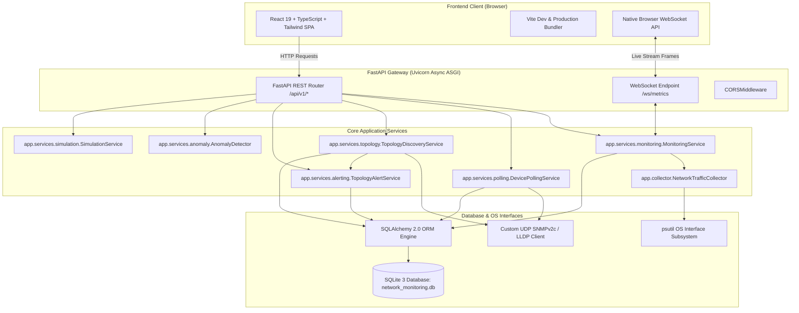
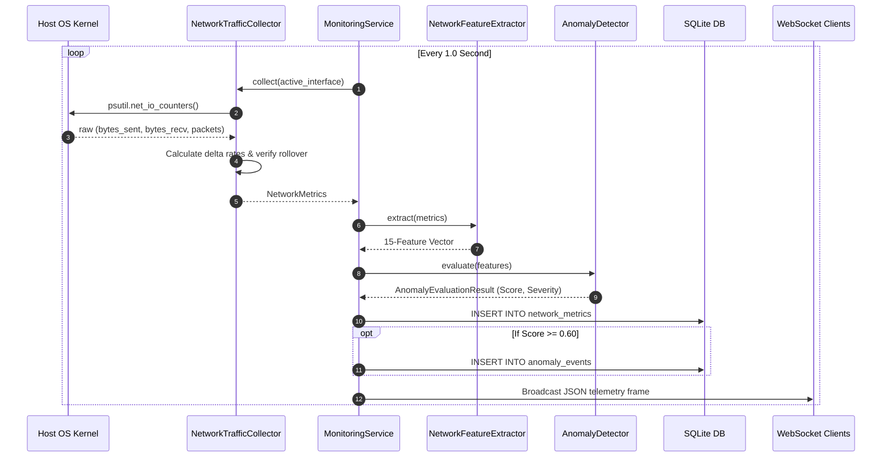
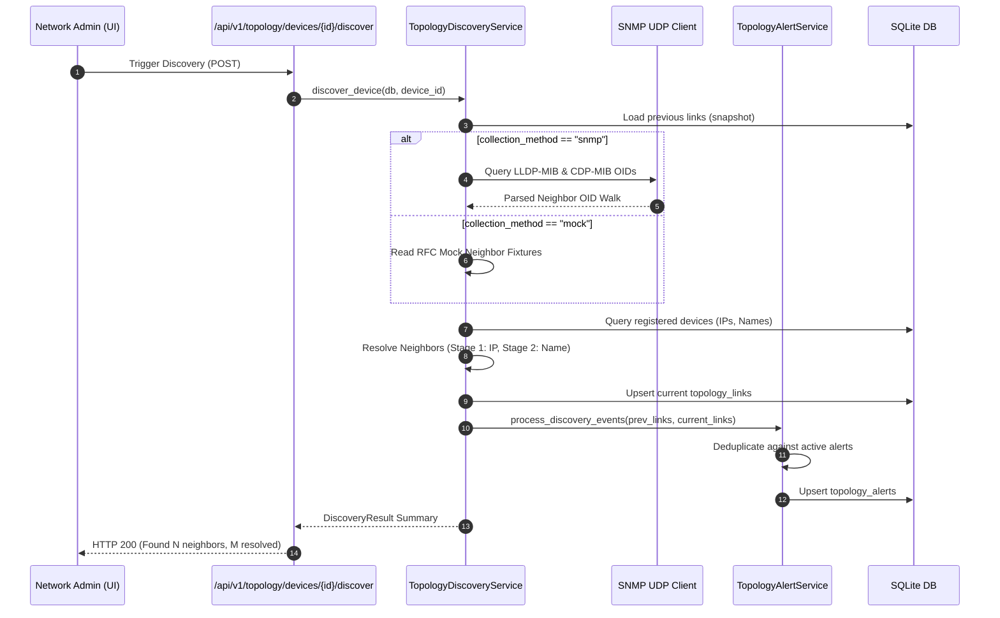
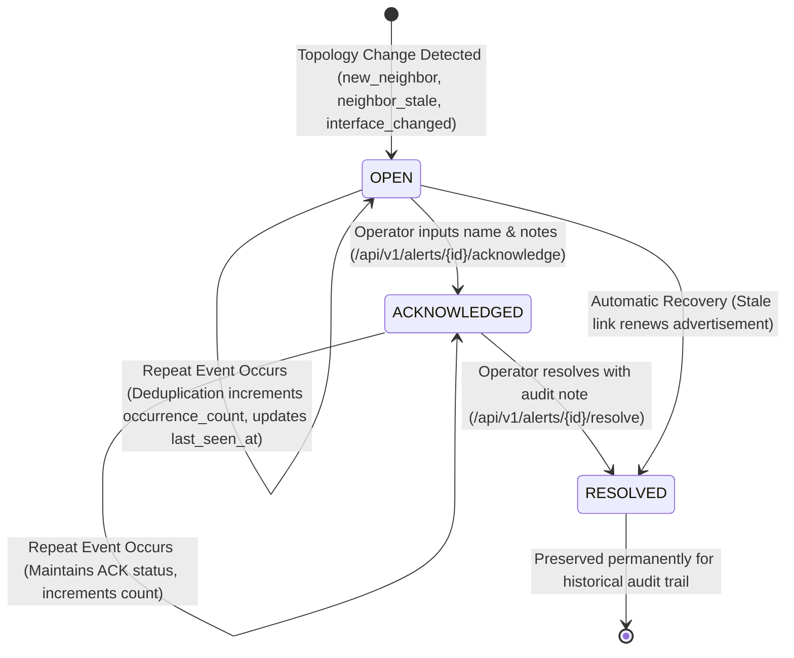
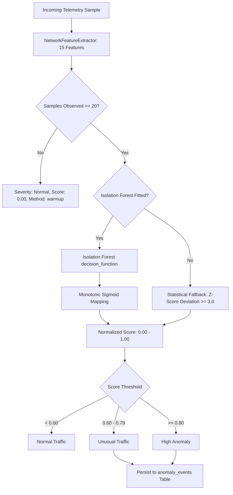
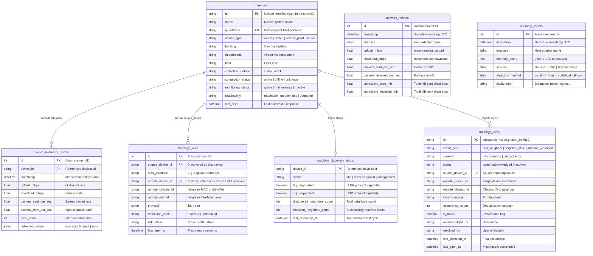

# 04 — Technical Architecture

This document provides a technical blueprint of the NetworkAI software architecture, module relationships, communication protocols, and design rationale.

---

## 1. High-Level Architecture Diagram

---

## 2. Telemetry Data Flow Diagram

---

## 3. Topology Discovery Sequence Diagram

---

## 4. Alert Lifecycle Diagram

---

## 5. Anomaly Detection Engine Flow

---

## 6. Database Entity Relationships (ERD)

---

## 7. Technology Rationale

| Layer | Chosen Technology | Architectural Rationale |
| :--- | :--- | :--- |
| **Backend Framework** | **FastAPI (Python)** | High-performance asynchronous execution, native WebSocket support, automatic OpenAPI/Swagger generation, and seamless integration with Python's scientific ecosystem (`scikit-learn`, `numpy`, `psutil`). |
| **Database** | **SQLite 3 (WAL Mode)** | Zero-configuration, serverless, self-contained single-file ACID persistence. Write-Ahead Logging (WAL) permits concurrent readers while background telemetry writers record samples, making it ideal for academic and small-to-medium institutional deployments. |
| **Telemetry Collector** | **`psutil`** | Cross-platform, mature, low-overhead C-extension reading kernel I/O counters directly without requiring administrative root privileges or raw packet-sniffing drivers (such as WinPcap/Npcap). |
| **Machine Learning** | **Isolation Forest** | Unsupervised algorithm with $O(n \log n)$ training complexity, specifically designed for anomaly detection. Unlike density estimators (e.g., GMMs) or distance-based methods (e.g., k-NN), Isolation Forest isolates anomalies using random partitioning trees without assuming normal Gaussian distributions. |
| **Frontend Framework** | **React 19 + Vite** | Component-driven declarative UI with instant Hot Module Replacement (HMR), TypeScript type safety, and optimized production chunk splitting. |
| **Styling** | **Tailwind CSS** | Utility-first styling enabling a clean, responsive, dark/light theme-adaptive enterprise NOC design system without bulky UI framework dependencies. |
