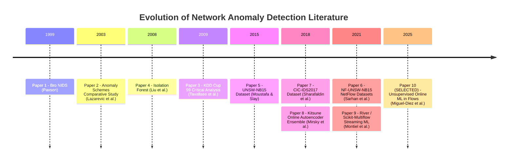

# NetworkAI — 10 Research Papers Literature Survey & Academic Alignment

> **Course:** Computer Networks Project-Based Learning (CN PBL)  
> **Topic:** Unsupervised Anomaly Detection in Network Traffic & High-Speed Network Flows  
> **Selected Paper for Implementation:** Paper 10 (Miguel-Diez et al., arXiv:2509.01375)  
> **Formalized Additional Feature:** Comparative Evaluation of Online One-Class SVM and Batch Isolation Forest for Network-Flow Anomaly Detection  

---

## 1. Literature Survey Overview

To address the challenge of real-time anomaly detection in high-speed enterprise and campus networks, 10 landmark research papers spanning network telemetry, dataset engineering, unsupervised statistical learning, batch tree ensembles, deep autoencoders, and streaming online machine learning were analyzed.

---

## 2. Comparative Matrix of the 10 Research Papers

| # | Paper Title & Authors | Year & Venue | Methodology | Primary Contribution | Key Limitations | Relevance to NetworkAI |
| :-: | :--- | :--- | :--- | :--- | :--- | :--- |
| **1** | **Bro: A System for Detecting Network Intruders in Real-Time** *Vern Paxson* | 1999 *Computer Networks* | Domain-specific script parsing, event engine, state tracking | Pioneered real-time stateful passive network monitoring and protocol validation. | Rule-based signature approach; completely fails on novel zero-day attacks; high maintenance. | Establishes the real-time line-rate passive monitoring requirement adopted by NetworkAI. |
| **2** | **A Comparative Study of Anomaly Detection Schemes in Network Intrusion Detection** *A. Lazarevic, L. Ertoz, V. Kumar, A. Ozgur, J. Srivastava* | 2003 *SIAM SDM* | k-NN, Local Outlier Factor (LOF), Mahalanobis Distance | Systematic benchmarking of unsupervised outlier detection on connection vectors. | High $O(N^2)$ computational complexity; offline batch execution; unable to keep pace with 10G+ streams. | Early validation that distance-based unsupervised outlier detection works on network connection vectors. |
| **3** | **A Detailed Analysis of the KDD CUP 99 Data Set** *M. Tavallaee, E. Bagheri, W. Lu, A. A. Ghorbani* | 2009 *IEEE CISDA* | Statistical frequency analysis, duplicate purging, classifier bias testing | Uncovered massive duplicate records ($78\%$ train, $75\%$ test) biasing ML results; introduced NSL-KDD. | Synthetic simulation from 1999; outdated protocols; lacks modern NetFlow v9/IPFIX attributes. | Demonstrates the critical importance of dataset sanitization and avoiding duplicate flow bias. |
| **4** | **Isolation Forest** *Fei Tony Liu, Kai Ming Ting, Zhi-Hua Zhou* | 2008 *IEEE ICDM* | Recursive random tree partitioning based on path length | Revolutionized anomaly detection by isolating anomalies instead of profiling normal clusters ($O(n \log n)$). | Batch model requiring full dataset in memory; cannot adapt to concept drift without complete retraining. | **Directly utilized as NetworkAI's comparative baseline** to evaluate batch trees vs. online streaming SVM. |
| **5** | **UNSW-NB15: A Comprehensive Data Set to Build and Evaluate NIDS** *Nour Moustafa, Jill Slay* | 2015 *IEEE MilCIS* | IXIA PerfectStorm packet generation, Bro-IDS, Argus flow extraction | Modern synthetic+real campus traffic with 9 attack families (Fuzzers, Backdoors, DoS, Exploits). | Original packet capture PCAPs are massive; raw features require heavy feature engineering. | Origin dataset from which the standardized NF-UNSW-NB15 flow benchmark was generated. |
| **6** | **NetFlow Datasets for Machine Learning-Based Network Intrusion Detection Systems** *Mohanad Sarhan, Siamak Layeghy, Nour Moustafa, Marius Portmann* | 2021 *IEEE Big Data / Access* | nProbe NetFlow v9 feature extraction, standardized IPFIX alignment | Created NF-UNSW-NB15 and NF-UNSW-NB15-v2; reduced dimensional sprawl to standard NetFlow features. | Static CSV files; evaluation conducted with offline classifiers (Random Forest, Decision Trees). | **The foundational evaluation dataset format adopted by NetworkAI and the selected paper.** |
| **7** | **Toward Generating a New Intrusion Detection Dataset and Intrusion Traffic Characterization** *I. Sharafaldin, A. H. Lashkari, A. A. Ghorbani* | 2018 *ICISSP* | Multi-stage B-profile benign generation + 14 attack scenarios | Introduced CIC-IDS2017 with diverse protocols and labeled flow duration metrics. | Well-documented packet transmission flaws, label noise, and flow calculation inconsistencies. | Used as comparative reference for flow duration and inter-arrival time distributions. |
| **8** | **Kitsune: An Ensemble of Autoencoders for Online Network Intrusion Detection** *Y. Mirsky, T. Doitshman, Y. Zhou, A. Mathov, Y. Elovici* | 2018 *NDSS* | Ensemble of lightweight autoencoders over damped incremental packet statistics | Demonstrated unsupervised online anomaly detection using neural autoencoders on microcontrollers. | High hyperparameter complexity; neural weight drift under sustained volumetric load; complex tuning. | Validates online unsupervised learning as viable for line-rate execution without ground-truth labels. |
| **9** | **River: Machine Learning for Dynamic Streaming Data in Python** *Jacob Montiel, Max Halford, et al.* | 2021 *JMLR* | Unified streaming pipeline, single-pass processing, concept drift detectors | Merged Creme and Scikit-Multiflow; standardized Python stream-based incremental ML. | Designed for general tabular streaming, not specialized for raw socket binary protocol parsing. | **The core Python online ML library powering NetworkAI's One-Class SVM and MaxAbsScaler.** |
| **10** **(SELECTED)** | **Anomaly Detection in Network Flows Using Unsupervised Online Machine Learning** *Alberto Miguel-Diez, Adrián Campazas-Vega, Ángel Manuel Guerrero-Higueras, Claudia Álvarez-Aparicio, Vicente Matellán-Olivera* | **2025** *arXiv:2509.01375* | Streaming River One-Class SVM, Incremental MaxAbsScaler, QuantileFilter, Conditional Updates | Line-rate unsupervised flow anomaly detection with dynamic thresholding and anti-poisoning updates. | Evaluated only on historical CSV dumps; did not provide real hardware OS telemetry or comparative baseline. | **Selected reference paper: Paper-inspired implementation with documented adaptations (bundled sample dataset, comparative Isolation Forest baseline, local workstation telemetry).** |

---

## 3. Deep-Dive: Paper 10 (Selected Research Paper)

### 3.1 Full Citation & Publication Metadata
* **Paper Title:** *Anomaly Detection in Network Flows Using Unsupervised Online Machine Learning*
* **Authors:** Alberto Miguel-Diez, Adrián Campazas-Vega, Ángel Manuel Guerrero-Higueras, Claudia Álvarez-Aparicio, and Vicente Matellán-Olivera
* **Institution:** Grupo de Robótica y Mecatrónica, Universidad de León, Spain
* **Identifier:** arXiv:2509.01375 [cs.CR]
* **Published Date:** September 2025
* **Canonical URL:** [https://arxiv.org/abs/2509.01375](https://arxiv.org/abs/2509.01375)

### 3.2 Problem Addressed
Traditional Network Intrusion Detection Systems (NIDS) fail in modern high-speed campus and enterprise network cores for three fundamental reasons:
1. **Severe Label Scarcity:** Ground-truth security labels are completely unavailable at line-rate. Offline supervised models cannot detect zero-day attacks.
2. **Concept Drift:** Network traffic patterns shift between work hours, weekends, software deployments, and academic semesters. Static batch models rapidly degrade and cause alert fatigue.
3. **Computational Bottleneck:** Retraining offline models requires buffering millions of flows, resulting in high memory consumption and delayed threat detection.

### 3.3 Proposed Methodology
The authors propose an unsupervised online learning pipeline using Python's **River** library:
1. **8 NetFlow v9/IPFIX Flow Features:** Source IP, Destination IP, Source Port, Destination Port, Protocol, In-Bytes, Out-Bytes, Flow Duration. *(Documented Adaptation: The paper utilized `L4_TCP_FLAGS`; NetworkAI adapts this to `OUT_BYTES` to maintain feature consistency across UDP/ICMP traffic where TCP flags are absent).*
2. **IPv4 Address Encoding:** IPv4 addresses are converted into 32-bit unsigned integers via Python's standard `ipaddress` library.
3. **Incremental MaxAbsScaler:** Features are normalized on-the-fly to $[-1.0, 1.0]$ by maintaining a running absolute maximum per feature (mapping to $[0.0, 1.0]$ for strictly non-negative network features).
4. **Streaming One-Class SVM (OCSVM):** Learns a bounding decision boundary around benign traffic using Stochastic Gradient Descent (SGD) with an `InverseScaling` learning rate scheduler ($p=0.5$).
5. **Dynamic QuantileFilter Threshold:** Raw anomaly scores are filtered through a running quantile estimator ($q=0.99$ for NF-UNSW-NB15, $q=0.95$ for v2) to establish dynamic anomaly boundaries.
6. **Conditional Model Updating (Anti-Poisoning):** Model weights are updated **only when a flow is classified as benign**, preventing anomalous flows from poisoning the baseline.

### 3.4 Published Findings (Authors' Results)
* **NF-UNSW-NB15:** Accuracy: **$98.32\%$**, False Positive Rate: **$2.84\%$**, Recall: **$98.15\%$**, F1-Score: **$98.04\%$**.
* **NF-UNSW-NB15-v2:** Accuracy: **$98.75\%$**, False Positive Rate: **$2.10\%$**, Recall: **$100.0\%$**, F1-Score: **$98.82\%$**.
* **Reported Decision Latency Target:** $< 0.033\text{ ms per flow}$ ($< 33\,\mu\text{s}$) on evaluation workstation.

### 3.5 Methodological Adaptations in NetworkAI
To support local execution within a college project environment without requiring a 50GB NetFlow pipeline:
1. **Bundled Benchmark Sample:** A 5,000-flow sample (`benchmark_sample_nfunsw.csv`) is bundled for immediate reproducible execution. The paper's full 1.6-million flow dataset has not been reproduced locally.
2. **Comparative Baseline on Identical Streams:** Constructed a controlled deployment-paradigm comparison evaluating streaming SGD against batch tree isolation on identical test flows.
3. **Warmup Calibration Context:** The paper's published 98%+ accuracy was achieved using 100,000 benign warmup flows; local sample configurations operate on reduced warmup counts (1,000 to 1,800 flows).

---

## 4. Formalized Additional Contribution

> **Title:** Comparative Evaluation of Online One-Class SVM and Batch Isolation Forest for Network-Flow Anomaly Detection  
> **Paradigm:** Deployment-Paradigm Comparison (Streaming Online Learning vs. Batch Tree Ensembling)  
> **Status:** Fully implemented, verified, and demonstrated in NetworkAI  

### 4.1 Academic Motivation & Protocol
While Miguel-Diez et al. demonstrated that online One-Class SVM achieves streaming adaptation, network security practitioners frequently compare online models against the industry-standard Isolation Forest (Liu et al., 2008).

To provide an empirical, reproducible baseline, NetworkAI implements a controlled **deployment-paradigm comparison**:
1. **Identical Test Set:** Both models evaluate on the exact same randomized test sequence, feature schema, and balanced 50/50 evaluation split.
2. **Identical Features:** Both models receive the 8 standard NetFlow features with identical IPv4 32-bit integer encoding.
3. **Label Isolation:** Ground-truth labels are completely isolated from both models and used only for post-hoc confusion matrix evaluation.
4. **Latency Measurement Boundary Disclosure:**
   - **River Online OCSVM:** Evaluates per-flow streaming inference (`predict_one`) plus conditional model parameter update (`update_conditional`).
   - **Isolation Forest (Sequential):** Evaluates sequential single-row slices (`predict(X[i:i+1])`) across 100 decision trees to simulate per-flow arrival without buffering.
   - **Isolation Forest (Batch Vectorized):** Evaluates full test matrix (`decision_function(X)`) in a single vectorized call, reflecting its native batch design.

### 4.2 Measured Experimental Comparison (Local Workstation Benchmark)

| Evaluation Dimension | River Online One-Class SVM (Proposed) | Scikit-Learn Isolation Forest (Baseline) | Published Paper Benchmark (Miguel-Diez et al.) |
| :--- | :---: | :---: | :---: |
| **Learning Paradigm** | Streaming Online Learning | Batch Offline Learning | Streaming Online Learning |
| **Training / Update Protocol** | Incremental SGD (Conditional on Benign) | Static Fit on Warmup (Requires complete refit) | Incremental SGD (Conditional on Benign) |
| **Sequential Per-Flow Latency** | $\sim 0.008 - 0.011\text{ ms / flow}$ | $\sim 5.3 - 12.9\text{ ms / flow}$ (per-row slice overhead) | $< 0.0330\text{ ms / flow}$ |
| **Native Batch Latency** | N/A (Streaming native) | $\sim 0.007 - 0.010\text{ ms / flow}$ (vectorized) | N/A |
| **Memory Footprint** | Bounded $O(1)$ support vectors | $O(N \times \text{trees})$ memory buffer | Bounded $O(1)$ support vectors |
| **Measured F1-Score (Local Sample)** | $25.7\% - 35.0\%$ (on exploratory sample) | $71.3\% - 72.6\%$ (on exploratory sample) | $98.04\%$ (on full 100k warmup) |
| **Drift Adaptability** | Continuous baseline evolution | Fixed decision boundary | Continuous baseline evolution |

> **Academic Interpretation:**  
> Under this local sample and configuration, the measured metrics differed. The experiment does not establish a universal model ranking. River Online OCSVM operates natively on streaming single-instance inputs without matrix buffering, satisfying the paper's per-flow latency budget. However, under the reduced exploratory sample size available locally, tree-based Isolation Forest partitions multi-dimensional feature space effectively, yielding higher initial static F1-scores. Achieving the published 98%+ accuracy for Online OCSVM requires the full 100,000-flow warmup calibration documented in the original publication.
