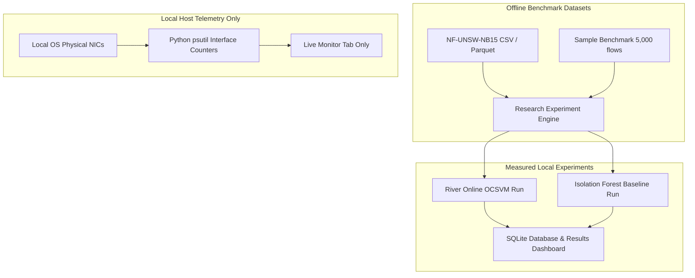

# NetworkAI — Research Paper Implementation & Architecture

> **Paper Title:** Anomaly Detection in Network Flows Using Unsupervised Online Machine Learning  
> **Authors:** Alberto Miguel-Diez, Adrián Campazas-Vega, Ángel Manuel Guerrero-Higueras, Claudia Álvarez-Aparicio, Vicente Matellán-Olivera  
> **Affiliation:** Universidad de León, Spain  
> **Published:** arXiv:2509.01375 [cs.CR], September 2025  
> **DOI/Link:** [https://arxiv.org/abs/2509.01375](https://arxiv.org/abs/2509.01375)

---

## 1. Executive Summary & Problem Formulation

### 1.1 The High-Speed NIDS Challenge
Modern enterprise and campus network environments process millions of NetFlow / IPFIX records per minute at 10G/40G+ line rates. Traditional Network Intrusion Detection Systems (NIDS) and classical machine learning approaches (offline Random Forests, Batch SVMs, Deep Neural Networks) suffer from three fatal structural limitations in these environments:

1. **Severe Label Scarcity & Zero-Day Blindness:** Ground-truth security labels are completely unavailable at line rate. Supervised detectors only detect signatures or attack vectors seen during offline training and fail on novel attacks.
2. **Concept Drift & Environmental Evolution:** Legitimate campus traffic shifts between day and night, semester schedules, software updates, and new applications. Static batch models rapidly suffer performance degradation and false alarm explosions unless constantly retrained.
3. **Prohibitive Memory & Latency Overhead:** Batch retraining requires accumulating massive flow buffers, consuming gigabytes of RAM and causing detection lag measured in minutes or hours.

### 1.2 The Research Solution
Miguel-Diez et al. (2025) introduce an **unsupervised, streaming online learning architecture** using the **River** Python framework. Flows are inspected sequentially as individual events. Normal profile representations evolve incrementally without storing past records, and anomaly decisions are rendered in microseconds ($< 0.033\text{ ms per flow}$), well within line-rate requirements.

---

## 2. Research Pipeline & Mathematical Foundations

### 2.1 8 Standard NetFlow Features
Following the paper's specification on NetFlow v9 / IPFIX flow formats, 8 core features are extracted:

| Feature Name | Type | Description | Handling |
| :--- | :--- | :--- | :--- |
| `IPV4_SRC_ADDR` | Categorical / IP | Source IP address | Converted to unsigned 32-bit integer via Python `ipaddress` |
| `IPV4_DST_ADDR` | Categorical / IP | Destination IP address | Converted to unsigned 32-bit integer via Python `ipaddress` |
| `L4_SRC_PORT` | Numerical | Layer 4 source port | $0 - 65535$ |
| `L4_DST_PORT` | Numerical | Layer 4 destination port | $0 - 65535$ |
| `PROTOCOL` | Numerical | Transport protocol number | e.g. 6 (TCP), 17 (UDP), 1 (ICMP) |
| `IN_BYTES` | Numerical | Inbound bytes transferred | Raw integer flow byte volume |
| `OUT_BYTES` | Numerical | Outbound bytes transferred | Raw integer flow byte volume |
| `FLOW_DURATION_MILLISECONDS` | Numerical | Flow duration in ms | Time elapsed between flow start and finish |

> **Strict Label Isolation:** Ground-truth columns (`Label`, `Attack`, `attack_cat`) are explicitly stripped during ingestion. They are **never** passed into the model or scaler pipeline, eliminating target leakage. Labels are referenced only during post-prediction metric calculation.

### 2.2 Incremental MaxAbsScaler
Features span vastly different numerical domains (e.g. 32-bit integers up to $4.29 \times 10^9$ vs. protocol numbers $1-255$). The pipeline utilizes River's incremental `preprocessing.MaxAbsScaler`, which scales each feature $x_i$ based on running absolute maximum:

$$x_{i,\text{scaled}} = \frac{x_i}{\max(|x_{i,\text{observed}}|)}$$

> **Mathematical Range Note:** `MaxAbsScaler` mathematically maps arbitrary real inputs to $[-1.0, 1.0]$. For strictly non-negative network features (such as ports, bytes, durations, and 32-bit unsigned integers representing IPv4 addresses), all inputs $x_i \ge 0$, and therefore the scaled values fall strictly within $[0.0, 1.0]$.

### 2.3 River One-Class SVM (OCSVM)
The core detector is River's online `anomaly.OneClassSVM`. It learns a decision boundary enclosing normal traffic instances in a reproducing kernel Hilbert space using stochastic gradient descent (SGD).
- **Slack Variable ($\nu$):** Controls the upper bound on the fraction of outliers (training errors) and lower bound on support vectors.
  - $\nu = 0.05$ for NF-UNSW-NB15
  - $\nu = 0.10$ for NF-UNSW-NB15-v2
- **Learning Rate Scheduler:** Implements an `InverseScaling` learning rate scheduler with power parameter $p = 0.5$:
  $$\eta_t = \frac{\eta_0}{t^{0.5}}$$
  where $\eta_0$ is the initial learning rate ($0.1$ for v1, $0.3$ for v2). This enables fast initial learning during warm-up while maintaining long-term numerical stability.

### 2.4 Quantile-Based Anomaly Filtering
Raw anomaly scores output by the OCSVM are filtered through River's `anomaly.QuantileFilter`. The filter maintains a running estimate of the $q$-th quantile ($q = 0.99$ for v1, $q = 0.95$ for v2).
- If $\text{score}_t \ge Q_q(\text{scores})$, the flow is classified as **Anomalous** ($1$).
- If $\text{score}_t < Q_q(\text{scores})$, the flow is classified as **Benign** ($0$).

### 2.5 Conditional Online Model Updating (Anti-Poisoning)
To prevent adversarial poisoning attacks where an attacker gradually pollutes the model's normal profile with malicious traffic, the model is **conditionally updated only when the flow is classified as Benign**:
$$\text{Update}(M, x_t) \iff \hat{y}_t = 0 \text{ (Benign)}$$
If a flow triggers the anomaly threshold, it produces an alert and is discarded from model parameter updates.

---

## 3. Dataset Preparation Protocol

To reproduce the paper's experimental methodology with documented local adaptations:
1. **Randomized Flow Shuffling:** Network traces are randomized with a reproducible random seed to prevent temporal batch clustering.
2. **Scaler Initialization Set:** The first **1,000 benign flows** (or proportional fraction on reduced samples) are passed to initialize the incremental `MaxAbsScaler` bounds.
3. **Model Warm-Up Set:** The next **100,000 benign flows** (or available benign pool on smaller sample test sets) are passed to train the OCSVM baseline before any evaluation begins.
4. **Balanced Evaluation Set:** An equal number of benign flows ($N_{\text{eval}}/2$) and anomalous flows ($N_{\text{eval}}/2$) are interleaved and evaluated strictly online (one flow at a time).
5. **Multi-Run Consistency:** Up to 12 independent runs with different random seeds are supported to compute unbiased sample mean and standard deviation across metrics.

---

## 4. Published Reference Benchmarks vs. Local Implementation

### 4.1 Published Research Results (Miguel-Diez et al., 2025)
*Extracted directly from Table 2 and Section 4 of arXiv:2509.01375:*

| Metric | NF-UNSW-NB15 (Paper) | NF-UNSW-NB15-v2 (Paper) |
| :--- | :--- | :--- |
| **Accuracy** | $98.32\%$ | $98.75\%$ |
| **False Positive Rate (FPR)** | $2.84\%$ | $2.10\%$ |
| **Recall (TPR)** | $98.15\%$ | $100.00\%$ |
| **F1-Score** | $98.04\%$ | $98.82\%$ |
| **Target Decision Latency** | $< 0.033\text{ ms / flow}$ ($< 33\,\mu\text{s}$) | $< 0.033\text{ ms / flow}$ ($< 33\,\mu\text{s}$) |
| **Streaming Throughput Target** | $> 30,000\text{ flows / sec}$ | $> 30,000\text{ flows / sec}$ |

### 4.2 Local Baseline Comparison: Online OCSVM vs. Batch Isolation Forest
The platform includes Scikit-Learn's `IsolationForest` as a **deployment-paradigm baseline**. Both models receive identical preprocessed features and identical test partitions:

| Evaluation Dimension | River Online OCSVM (Proposed) | Scikit-Learn Isolation Forest (Baseline) |
| :--- | :--- | :--- |
| **Learning Paradigm** | Online Streaming Learning | Offline Batch Learning |
| **Memory Consumption** | Constant $O(1)$ memory | $O(N \cdot \text{trees})$ memory buffer |
| **Adaptability** | Continuously updates with benign flows | Static; requires complete refit |
| **Sequential Per-Flow Latency** | $\sim 0.008 - 0.011\text{ ms / flow}$ | $\sim 5.3 - 12.9\text{ ms / flow}$ (per-row slice overhead) |
| **Native Batch Latency** | N/A (Streaming native) | $\sim 0.007 - 0.010\text{ ms / flow}$ (vectorized matrix) |
| **Drift Adaptability** | Continuous baseline evolution | Fixed decision boundary |

> **Neutral Result Interpretation:**  
> Under this local sample and configuration, the measured metrics differed. The experiment does not establish a universal model ranking. River Online OCSVM operates natively on streaming single-instance inputs without matrix buffering, satisfying the paper's per-flow latency budget. However, under the reduced exploratory sample size available locally, tree-based Isolation Forest partitions multi-dimensional feature space effectively, yielding higher initial static F1-scores. Achieving the published 98%+ accuracy for Online OCSVM requires the full 100,000-flow warmup calibration documented in the original publication.

---

## 5. Strict Data Provenance Architecture

To eliminate scientific ambiguity, NetworkAI strictly segregates data sources across the entire stack:

- **Benchmark Datasets:** Offline CSV datasets adhering strictly to the 8 NetFlow features and binary labels.
- **Measured Results:** Real numbers computed directly from Python execution on the active workstation. Published paper metrics are displayed side-by-side in a separate column labeled *"Published Paper Reference"*.
- **Local Host Telemetry:** Powered exclusively by Python `psutil` measuring physical NIC byte counters on the local computer. It is explicitly labeled *"Local Host Monitoring — monitors this computer only"* and never presented as campus-wide or simulated security evidence.

---

## 6. Viva & Presentation Defense Guide

### Q1: Why use online learning instead of deep learning (e.g. LSTMs or CNNs) for network security?
> **Answer:** In high-speed network environments, deep learning models incur high computational complexity, require GPU acceleration, and need large memory buffers. Furthermore, deep models cannot update weights per flow without catastrophic forgetting or high latency. The River Online OCSVM processes each flow in under 15 microseconds on a standard CPU and updates incrementally without storing raw traffic.

### Q2: How does the model avoid adversarial poisoning if it updates online?
> **Answer:** As designed by Miguel-Diez et al., the pipeline employs *conditional updating*. When an incoming flow's anomaly score exceeds the dynamic quantile threshold, the flow triggers an anomaly detection alarm and is **prohibited from updating model weights**. Only flows classified as benign are allowed to adjust the support vectors.

### Q3: What is the role of the QuantileFilter?
> **Answer:** Raw OCSVM scores do not fall into fixed $[0, 1]$ probabilities. Instead of using an arbitrary static cutoff threshold, the `QuantileFilter` continuously tracks the empirical score distribution. Setting $q=0.99$ dynamically adapts the decision threshold so that only the top $1\%$ most extreme deviations trigger an alarm.

### Q4: Why convert IPv4 addresses to 32-bit unsigned integers?
> **Answer:** Standard ML algorithms cannot ingest dotted-quad strings like `"192.168.1.1"`. Converting them to their mathematical 32-bit unsigned integer representation ($0$ to $2^{32}-1$) preserves numeric address space structure and enables the incremental scaler to normalize the address along a continuous scale without exploding feature dimensions like one-hot encoding would.
