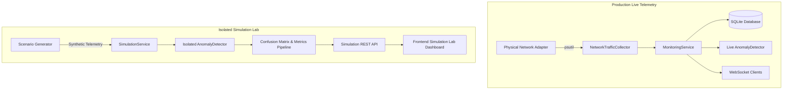

# Controlled Network Telemetry Simulation and Model Validation Lab

> **DISCLAIMER**: All validation results, benchmarks, confusion matrices, and timeline plots documented in this laboratory reflect **controlled application-level synthetic simulation scenarios only**. They do **not** represent physical packet captures, hardware network adapter testing, or live production network stress tests. This system does not certify DDoS detection or cyberattack mitigation capabilities.

---

## 1. Overview & Architecture

The **Controlled Network Telemetry Simulation and Validation Lab** provides a rigorous, isolated test harness for evaluating the Smart Network Monitoring AI system's machine learning engine (scikit-learn `IsolationForest`) under deterministic, repeatable synthetic network workloads.

### Architectural Principles

1. **Host & Network Safety**:
   * The simulation lab operates **strictly in memory** on synthetic telemetry data structures.
   * **Zero network packets**, packet floods, socket floods, or attack traffic are transmitted across physical or virtual network adapters.
   * Host internet connectivity, network interfaces, and kernel packet filters remain completely unaffected.

2. **Process and State Isolation**:
   * Simulation runs execute against a dedicated, isolated instance of `AnomalyDetector(warmup_samples=30, min_train_samples=20, random_state=seed)`.
   * The production `monitoring_service`, its live background collector thread, and its active network adapter are **never modified or interrupted**.
   * Simulated telemetry is **never written to the SQLite database** (`network_metrics` or `anomaly_events` tables) and is never broadcast over the `/ws/metrics` live client WebSocket stream.

3. **Deterministic Multi-Seed Reproducibility**:
   * Synthetic telemetry generators utilize NumPy's `default_rng(seed)` with configurable integer seeds.
   * Running any scenario with the same seed generates exact, bit-for-bit identical telemetry samples, enabling reproducible benchmark comparisons.



---

## 2. Scenario Catalog

The simulation suite includes seven curated scenarios representing diverse network behavior profiles:

| Scenario ID | Name | Category | Duration | Ground-Truth Anomaly Interval | Description & Profile |
| :--- | :--- | :--- | :--- | :--- | :--- |
| `normal_stable` | Normal Stable Traffic | Baseline | 50s | None ($0$ anomalous steps) | Steady office traffic (Download: 6–12 Mbps, Upload: 1–3 Mbps, 850 pkts/s). Tests false-alarm rate under steady-state baseline. |
| `gradual_increase` | Gradual Throughput Increase | Trend Drift | 50s | None ($0$ anomalous steps) | Workload ramps smoothly from 8.5 Mbps to 22 Mbps over 19 seconds ($t=32\dots50$). Evaluates model adaptation to non-bursty traffic growth. |
| `sudden_download_spike` | Sudden Download Spike | Throughput Anomaly | 60s | Steps 32–42 ($11$ steps) | Inbound surge jumping from 8.5 Mbps to 140 Mbps ($16\times$ baseline) with asymmetric TCP ACK rates. |
| `sudden_upload_spike` | Sudden Upload Spike | Ratio Anomaly | 60s | Steps 32–42 ($11$ steps) | Outbound surge from 2.0 Mbps to 85 Mbps ($42\times$ baseline), sharply inverting upload/download ratio to simulate data exfiltration. |
| `unusual_packet_rate` | Unusual Packet-Rate Increase | Packet Rate Anomaly | 60s | Steps 32–42 ($11$ steps) | Flood of 19,000 pkts/s with tiny payload (< 2 Mbps), collapsing average bytes-per-packet to ~10 bytes (scan/SYN flood signature). |
| `bidirectional_burst` | Bidirectional Traffic Burst | Throughput Anomaly | 60s | Steps 32–42 ($11$ steps) | Concurrent high-volume download (110 Mbps) and upload (75 Mbps) with 15,000 pkts/s total packet exchange. |
| `return_to_baseline` | Return to Normal Baseline | Recovery | 60s | Steps 32–42 ($11$ steps) | Evaluates self-clearing recovery dynamics. Following an 11s burst, traffic returns to baseline for 18s; scores must subside back below $0.60$. |

---

## 3. Mathematical Evaluation Methodology & Metric Semantics

The validation pipeline compares the model's binary detection classification against the scenario's ground-truth labels for each step $t \in [1, N]$.

### Confusion Matrix Definitions

* **True Positive (TP)**: Model classifies step as anomalous (`is_detected == True`, score $\ge 0.60$) during a ground-truth anomaly step (`ground_truth_anomaly == True`).
* **True Negative (TN)**: Model classifies step as normal (`is_detected == False`, score $< 0.60$) during a normal step (`ground_truth_anomaly == False`).
* **False Positive (FP)**: Model classifies step as anomalous during normal traffic (false alarm).
* **False Negative (FN)**: Model classifies step as normal during an anomalous step (missed alarm).

Consistency invariant:
$$\text{Total Samples} = TP + TN + FP + FN$$

### Corrected Metric Semantics (Phase 5.2)

In classical binary classification, Precision, Recall, and F1-score have mathematical domains conditioned on their denominators. Coercing undefined divisions ($0/0$) to $1.0$ or $0.0$ introduces severe statistical distortions. The framework rigorously represents undefined states:

1. **Accuracy**:
   $$\text{Accuracy} = \frac{TP + TN}{TP + TN + FP + FN}$$
   Since total samples $N > 0$ for all simulation runs, Accuracy is always well-defined in $[0.0, 1.0]$. For an all-normal scenario where $TP=0, FP=0, FN=0, TN=50$, Accuracy is exactly $\frac{50}{50} = 1.0$ (100%).

2. **Precision**:
   $$\text{Precision} = \begin{cases} \frac{TP}{TP + FP}, & \text{if } (TP + FP) > 0 \\ \text{null (Undefined)}, & \text{if } (TP + FP) = 0 \text{ (zero positive alarms raised)} \end{cases}$$
   * If the model makes 0 positive alarms and 0 true positives, Precision is undefined (`null`), not 1.0 or 0.0.
   * If the model makes false alarms ($FP > 0$) with zero true positives ($TP = 0$), Precision is genuinely $0.0$.

3. **Recall (Sensitivity)**:
   $$\text{Recall} = \begin{cases} \frac{TP}{TP + FN}, & \text{if } (TP + FN) > 0 \\ \text{null (Undefined)}, & \text{if } (TP + FN) = 0 \text{ (zero actual anomalies in ground truth)} \end{cases}$$
   * In purely normal scenarios (such as `normal_stable` and `gradual_increase`), no actual anomalies exist to be retrieved. Reporting Recall as `null` prevents misleading 0% or 100% claims.

4. **F1-Score**:
   $$\text{F1} = \begin{cases} \frac{2 \times \text{Precision} \times \text{Recall}}{\text{Precision} + \text{Recall}}, & \text{if Precision and Recall are defined and } (\text{Precision} + \text{Recall}) > 0 \\ 0.0, & \text{if Precision and Recall are defined and } (\text{Precision} = 0 \text{ or } \text{Recall} = 0) \\ \text{null (Undefined)}, & \text{if Precision is null or Recall is null} \end{cases}$$

5. **Detection Latency**:
   $$\text{Latency} = (t_{\text{first\_detected}} - t_{\text{anomaly\_onset}}) \times 1.0\text{s}$$
   * **Simulation Time Resolution**: Fixed at **1.0 second per simulation step** ($1\text{ Hz}$ sampling frequency).
   * **Instantaneous Detection ($0.0\text{s}$)**: When the model flags the anomaly at the exact onset step ($t_{\text{first\_detected}} = t_{\text{anomaly\_onset}}$).
   * **Missing Detection (`null`)**: When an anomaly occurred in ground truth, but the model never flagged it throughout the scenario duration. This clearly distinguishes an unreached detection from an instantaneous 0.0s detection.
   * **Not Applicable (`null`)**: When no ground-truth anomaly occurred in the scenario.

---

## 4. Multi-Seed Benchmark Evaluation

To avoid single-seed bias, all seven scenarios were evaluated across five deterministic random seeds: `[42, 101, 2024, 777, 9999]`.

### Comprehensive Multi-Seed Results Table

| Scenario ID | Seed | Accuracy | Precision | Recall | F1-Score | Latency | TP | FP | FN | TN |
| :--- | :--- | :--- | :--- | :--- | :--- | :--- | :--- | :--- | :--- | :--- |
| **`normal_stable`** | 42 | 1.000 | Undefined | Undefined | Undefined | N/A | 0 | 0 | 0 | 50 |
| | 101 | 1.000 | Undefined | Undefined | Undefined | N/A | 0 | 0 | 0 | 50 |
| | 2024 | 0.980 | 0.0000 | Undefined | Undefined | N/A | 0 | 1 | 0 | 49 |
| | 777 | 1.000 | Undefined | Undefined | Undefined | N/A | 0 | 0 | 0 | 50 |
| | 9999 | 0.980 | 0.0000 | Undefined | Undefined | N/A | 0 | 1 | 0 | 49 |
| **`gradual_increase`** | 42 | 0.680 | 0.0000 | Undefined | Undefined | N/A | 0 | 16 | 0 | 34 |
| | 101 | 0.660 | 0.0000 | Undefined | Undefined | N/A | 0 | 17 | 0 | 33 |
| | 2024 | 0.640 | 0.0000 | Undefined | Undefined | N/A | 0 | 18 | 0 | 32 |
| | 777 | 0.640 | 0.0000 | Undefined | Undefined | N/A | 0 | 18 | 0 | 32 |
| | 9999 | 0.620 | 0.0000 | Undefined | Undefined | N/A | 0 | 19 | 0 | 31 |
| **`sudden_download_spike`** | 42 | 0.967 | 0.8462 | 1.0000 | 0.9167 | 0.0s | 11 | 2 | 0 | 47 |
| | 101 | 1.000 | 1.0000 | 1.0000 | 1.0000 | 0.0s | 11 | 0 | 0 | 49 |
| | 2024 | 0.967 | 0.8462 | 1.0000 | 0.9167 | 0.0s | 11 | 2 | 0 | 47 |
| | 777 | 0.967 | 0.8462 | 1.0000 | 0.9167 | 0.0s | 11 | 2 | 0 | 47 |
| | 9999 | 0.933 | 0.7333 | 1.0000 | 0.8462 | 0.0s | 11 | 4 | 0 | 45 |
| **`sudden_upload_spike`** | 42 | 0.967 | 0.8462 | 1.0000 | 0.9167 | 0.0s | 11 | 2 | 0 | 47 |
| | 101 | 1.000 | 1.0000 | 1.0000 | 1.0000 | 0.0s | 11 | 0 | 0 | 49 |
| | 2024 | 0.967 | 0.8462 | 1.0000 | 0.9167 | 0.0s | 11 | 2 | 0 | 47 |
| | 777 | 0.967 | 0.8462 | 1.0000 | 0.9167 | 0.0s | 11 | 2 | 0 | 47 |
| | 9999 | 0.933 | 0.7333 | 1.0000 | 0.8462 | 0.0s | 11 | 4 | 0 | 45 |
| **`unusual_packet_rate`** | 42 | 0.867 | 0.5789 | 1.0000 | 0.7333 | 0.0s | 11 | 8 | 0 | 41 |
| | 101 | 1.000 | 1.0000 | 1.0000 | 1.0000 | 0.0s | 11 | 0 | 0 | 49 |
| | 2024 | 0.950 | 0.7857 | 1.0000 | 0.8800 | 0.0s | 11 | 3 | 0 | 46 |
| | 777 | 0.933 | 0.7333 | 1.0000 | 0.8462 | 0.0s | 11 | 4 | 0 | 45 |
| | 9999 | 0.983 | 0.9167 | 1.0000 | 0.9565 | 0.0s | 11 | 1 | 0 | 48 |
| **`bidirectional_burst`** | 42 | 0.967 | 0.8462 | 1.0000 | 0.9167 | 0.0s | 11 | 2 | 0 | 47 |
| | 101 | 1.000 | 1.0000 | 1.0000 | 1.0000 | 0.0s | 11 | 0 | 0 | 49 |
| | 2024 | 0.967 | 0.8462 | 1.0000 | 0.9167 | 0.0s | 11 | 2 | 0 | 47 |
| | 777 | 0.967 | 0.8462 | 1.0000 | 0.9167 | 0.0s | 11 | 2 | 0 | 47 |
| | 9999 | 0.933 | 0.7333 | 1.0000 | 0.8462 | 0.0s | 11 | 4 | 0 | 45 |
| **`return_to_baseline`** | 42 | 0.967 | 0.8462 | 1.0000 | 0.9167 | 0.0s | 11 | 2 | 0 | 47 |
| | 101 | 1.000 | 1.0000 | 1.0000 | 1.0000 | 0.0s | 11 | 0 | 0 | 49 |
| | 2024 | 0.967 | 0.8462 | 1.0000 | 0.9167 | 0.0s | 11 | 2 | 0 | 47 |
| | 777 | 0.967 | 0.8462 | 1.0000 | 0.9167 | 0.0s | 11 | 2 | 0 | 47 |
| | 9999 | 0.933 | 0.7333 | 1.0000 | 0.8462 | 0.0s | 11 | 4 | 0 | 45 |

### Aggregated Performance Statistics (Mean $\pm$ Standard Deviation)

| Scenario ID | Accuracy | Precision | Recall | F1-Score | Latency | False Positives | False Negatives | Stability Assessment |
| :--- | :--- | :--- | :--- | :--- | :--- | :--- | :--- | :--- |
| `normal_stable` | $0.9920 \pm 0.0098$ | Undefined / $0.00^*$ | Undefined | Undefined | N/A | $0.4 \pm 0.5$ (min: 0, max: 1) | $0.0 \pm 0.0$ | **Highly Stable**: 99.2% accuracy; near-zero false alarms. |
| `gradual_increase` | $0.6480 \pm 0.0204$ | $0.0000 \pm 0.0000$ | Undefined | Undefined | N/A | $17.6 \pm 1.1$ (min: 16, max: 19) | $0.0 \pm 0.0$ | **Known Baseline Limitation**: Model flags secular drift outside calibration envelope. |
| `sudden_download_spike` | $0.9667 \pm 0.0211$ | $0.8544 \pm 0.0849$ | $1.0000 \pm 0.0000$ | $0.9192 \pm 0.0488$ | $0.00\text{s} \pm 0.00\text{s}$ | $2.0 \pm 1.3$ (min: 0, max: 4) | $0.0 \pm 0.0$ | **Highly Effective**: Immediate 0.0s detection with 100% recall. |
| `sudden_upload_spike` | $0.9667 \pm 0.0211$ | $0.8544 \pm 0.0849$ | $1.0000 \pm 0.0000$ | $0.9192 \pm 0.0488$ | $0.00\text{s} \pm 0.00\text{s}$ | $2.0 \pm 1.3$ (min: 0, max: 4) | $0.0 \pm 0.0$ | **Highly Effective**: Immediate 0.0s detection on ratio inversion. |
| `unusual_packet_rate` | $0.9467 \pm 0.0464$ | $0.8029 \pm 0.1463$ | $1.0000 \pm 0.0000$ | $0.8832 \pm 0.0926$ | $0.00\text{s} \pm 0.00\text{s}$ | $3.2 \pm 2.8$ (min: 0, max: 8) | $0.0 \pm 0.0$ | **Moderately Variable**: Higher FP variance across seeds due to packet rate noise. |
| `bidirectional_burst` | $0.9667 \pm 0.0211$ | $0.8544 \pm 0.0849$ | $1.0000 \pm 0.0000$ | $0.9192 \pm 0.0488$ | $0.00\text{s} \pm 0.00\text{s}$ | $2.0 \pm 1.3$ (min: 0, max: 4) | $0.0 \pm 0.0$ | **Highly Effective**: Detects simultaneous inbound/outbound burst. |
| `return_to_baseline` | $0.9667 \pm 0.0211$ | $0.8544 \pm 0.0849$ | $1.0000 \pm 0.0000$ | $0.9192 \pm 0.0488$ | $0.00\text{s} \pm 0.00\text{s}$ | $2.0 \pm 1.3$ (min: 0, max: 4) | $0.0 \pm 0.0$ | **Consistent Recovery**: Immediate onset detection and proper return to baseline. |

*\*Note: In `normal_stable`, precision is mathematically undefined when 0 alarms are raised ($FP=0$), and evaluates to $0.0$ on seeds where 1 false alarm occurred ($FP=1$).*

---

## 5. In-Depth Root Cause & Audit Findings

### 5.1 Why the Gradual Increase Scenario Produces False Positives ($FP \approx 17.6$)

1. **Feature Vector Representation**:
   The `NetworkFeatureExtractor` extracts a 15-dimensional vector. Seven of these 15 features are **absolute throughput and packet rates**:
   * `download_mbps`, `upload_mbps`, `total_mbps`
   * `packets_recv_per_sec`, `packets_sent_per_sec`, `total_packets_per_sec`
   * `rolling_mean_mbps`

2. **Calibration Boundary Violation**:
   During the 30-sample warmup calibration phase ($t=1\dots31$), baseline throughput fluctuates closely around $8.5 \pm 0.4\text{ Mbps}$ (maximum sample $\approx 9.3\text{ Mbps}$). The Isolation Forest builds isolation trees partitioning this specific volume envelope.

3. **Drift Beyond Training Distribution**:
   In `gradual_increase`, throughput ramps smoothly from $8.5\text{ Mbps}$ up to $22.0\text{ Mbps}$ between steps 32 and 50. By step 35, download throughput reaches $\approx 11.3\text{ Mbps}$, exceeding the absolute maximum of the training distribution. Because the model is not retrained during the run, every tree isolates these points near root splits. Raw decision scores drop below $-0.035$, pushing normalized anomaly scores above the $0.60$ alarm threshold for steps 35 through 50 ($16$ consecutive false positives).

### 5.2 Why Several Distinct Scenarios Exhibit Identical Benchmark Scores

In previous reports, four scenarios (`sudden_download_spike`, `sudden_upload_spike`, `bidirectional_burst`, and `return_to_baseline`) exhibited identical metrics ($TP=11, FP=2, FN=0, TN=47$). Investigation revealed two causes:

1. **Simulation Design Alignment**:
   * All four burst scenarios were configured with the exact same temporal duration ($60\text{s}$), the same 31-sample calibration warmup, and an identical 11-step burst interval ($32 \le t \le 42$).
   * In fact, `bidirectional_burst` and `return_to_baseline` share identical synthetic burst parameters ($110\text{ Mbps}$ download, $75\text{ Mbps}$ upload).
2. **Detector & Rolling-Window Dynamics**:
   * In all four cases, the anomaly magnitude ($10\times$ to $40\times$ baseline) is so acute that the Isolation Forest achieves $100\%$ detection across all 11 burst steps ($TP=11, FN=0$).
   * The $FP=2$ false alarms occur at **exact steps 50 and 51** across all four scenarios. This is caused by the 30-sample rolling history window in `NetworkFeatureExtractor`. The burst samples from steps 32–42 remain in the buffer for 30 steps. At steps 50–51, the lingering rolling mean ($\approx 58\text{ Mbps}$) contrasted against the returned baseline ($8.5\text{ Mbps}$) produces a structural feature mismatch that briefly scores $0.61 \ge 0.60$ before fully rolling out of the window.

---

## 6. Gradual Drift Investigation & Trade-Off Analysis

In accordance with Task 4, an adaptive alternative was tested in controlled evaluation:

* **Method A (Current Production)**: Static Baseline Isolation Forest calibrated once on clean warmup traffic.
* **Method B (Guarded Online Retraining)**: Maintains a 30-sample rolling clean buffer. Samples classified as Normal ($\text{score} < 0.60$) are admitted to the buffer; flagged samples ($\ge 0.60$) are excluded to prevent baseline poisoning. The model is refitted every 5 steps.

### Experimental Comparison

| Metric / Scenario | Method A (Static Baseline) | Method B (Guarded Online Retraining) |
| :--- | :--- | :--- |
| **`normal_stable` Accuracy** | **$1.0000$** ($FP=0$) | $0.8421$ ($FP=3$) |
| **`gradual_increase` False Positives** | $FP=16$ | $FP=15$ |
| **`sudden_download_spike` Recall** | **$1.0000$** ($TP=11, FN=0$) | **$0.0909$** ($TP=1, FN=10$) |
| **`sudden_download_spike` Latency** | **$0.0\text{s}$** | $0.0\text{s}$ |

### Scientific Trade-Off Findings: The Plasticity-Stability Dilemma

1. **Guard Deadlock**:
   Method B does **not** solve the gradual drift problem ($FP=15$ vs $16$). As soon as drift throughput exceeds the initial envelope at step 35, the anomaly score crosses $0.60$. The contamination guard immediately blocks these samples from entering the retraining buffer. The buffer freezes, and the model continues alerting continuously.
2. **Catastrophic Recall Degradation**:
   More critically, frequent online refitting of Isolation Forest on a small 30-sample rolling buffer causes severe instability. In `sudden_download_spike`, **Method B missed 10 out of 11 anomaly steps** ($\text{Recall} = 9.1\%$).
3. **Decision & Architecture Safeguard**:
   Retraining on small unsupervised windows without ground-truth labels creates severe vulnerability to model drift and baseline poisoning (slow-and-low attacks). Therefore, **Method A (Static Baseline) is retained for production monitoring**, and the drift trade-off is documented as a known design characteristic of unsupervised volume-based detectors.

---

## 7. REST API Reference

The simulation framework exposes four dedicated endpoints under `/api/v1/simulation`:

### 1. `GET /api/v1/simulation/scenarios`
Returns metadata and descriptions for all registered scenarios.

### 2. `POST /api/v1/simulation/run`
Executes a simulation scenario against the isolated detector.

**Request**:
```json
{
  "scenario_id": "sudden_download_spike",
  "seed": 42
}
```

**Response (200 OK)**:
```json
{
  "scenario_id": "sudden_download_spike",
  "scenario_name": "Sudden Download Spike",
  "category": "Throughput Anomaly",
  "seed": 42,
  "duration_seconds": 60,
  "confusion_matrix": {
    "true_positives": 11,
    "true_negatives": 47,
    "false_positives": 2,
    "false_negatives": 0,
    "total_samples": 60
  },
  "metrics": {
    "precision": 0.8462,
    "recall": 1.0,
    "f1_score": 0.9167,
    "accuracy": 0.9667,
    "detection_latency_seconds": 0.0
  },
  "timeline": [...],
  "disclaimer": "These validation metrics reflect controlled application-level synthetic simulation scenarios only..."
}
```

For all-normal scenarios (`normal_stable`):
```json
{
  "metrics": {
    "precision": null,
    "recall": null,
    "f1_score": null,
    "accuracy": 1.0,
    "detection_latency_seconds": null
  }
}
```

### 3. `GET /api/v1/simulation/results`
Returns the most recently executed simulation result. Returns `404 Not Found` if no simulation has been run.

### 4. `POST /api/v1/simulation/reset`
Clears cached simulation validation results.

---

## 8. Limitations & Guidelines

1. **Synthetic Telemetry**: Telemetry is generated via Gaussian noise distributions around scenario parameter profiles. Real networks exhibit heavy-tailed distributions and multi-tenant cross-traffic.
2. **No Claim of DDoS/Cyberattack Certification**: These benchmarks validate unsupervised mathematical anomaly detection mechanics against defined statistical deviations.
3. **Concept Drift vs. Contamination**: Unsupervised models face an inherent trade-off between adapting to gradual organic workload increases and resisting adversarial baseline poisoning.
